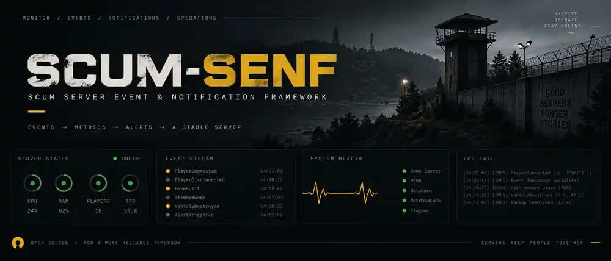

# SCUM-SENF

**SCUM Server Event & Notification Framework**

Open-source operational tooling for SCUM servers. **Telemetry over guessing.**

## Status

Foundation only. FuE/research and architecture are **not frozen yet**.  
No production-ready release exists.

## Direction

- observe server and service health
- normalize useful events and alerts
- retain crash, restart and backup evidence
- expose status/notifications for Discord and APIs

Details stay intentionally open until FuE is complete.

## Contributing

Start with [AGENTS.md](AGENTS.md) and [CONTRIBUTING.md](CONTRIBUTING.md).  
Security reports: [SECURITY.md](SECURITY.md).

## Support

SCUM-SENF is free and community-supported.  
Voluntary support: [Ko-fi](https://ko-fi.com/keilerhirsch).

## License

[EUPL-1.2](LICENSE)

## Disclaimer

SCUM-SENF is an unofficial community project and is not affiliated with or endorsed by the developers or publishers of SCUM. Names and marks belong to their respective owners.
